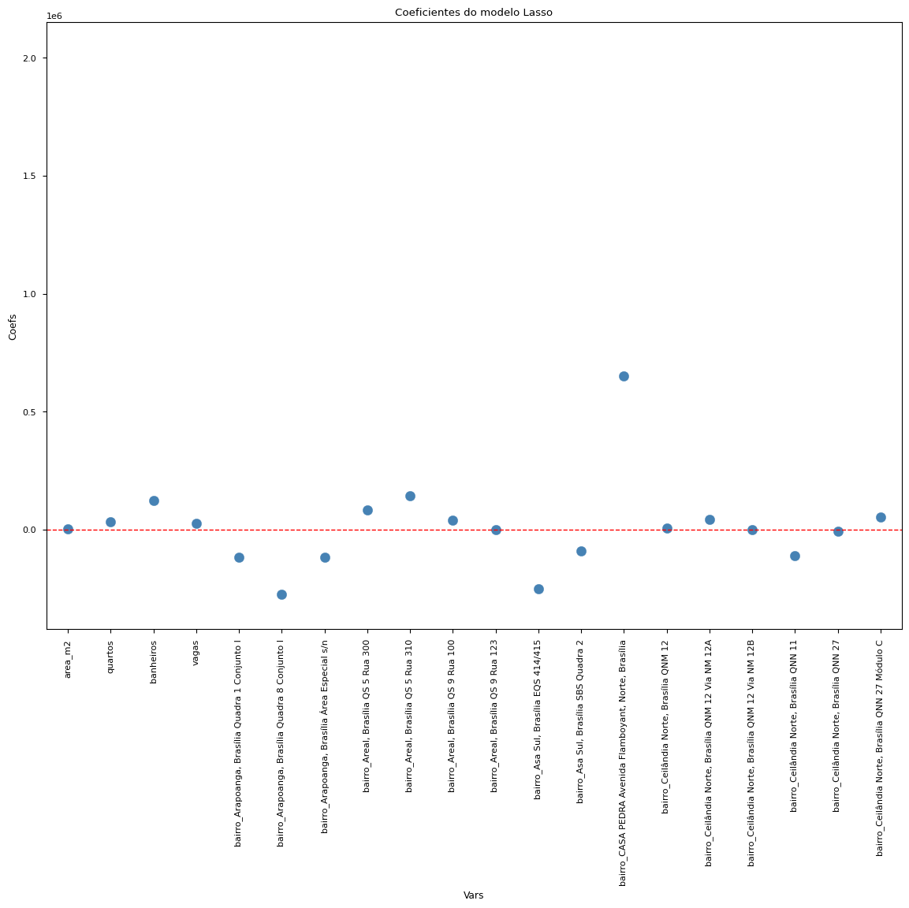
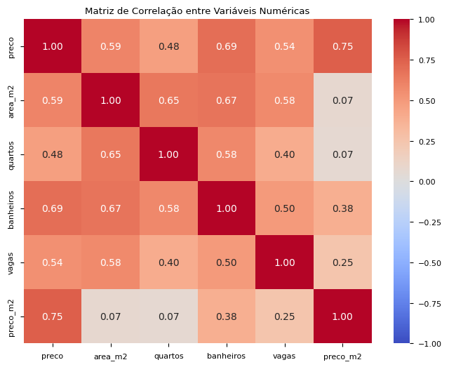

# Codigos-da-Avaliação
Notebook do código: [ipynb](./av01.ipynb)

Métricas dos modelos: 

```text
                   Modelo     R²      MAE (R$)     RMSE (R$)
Regressão Linear Múltipla 0.5021  R$ 187,288.53  R$ 256,269.40
 Regressão com log(preco) 0.7185  R$ 127,706.24  R$ 192,699.36
            Ridge    (L2) 0.7659  R$ 112,364.83  R$ 175,736.08
            Lasso    (L1) 0.7992  R$ 99,321.59   R$ 162,739.62
```




